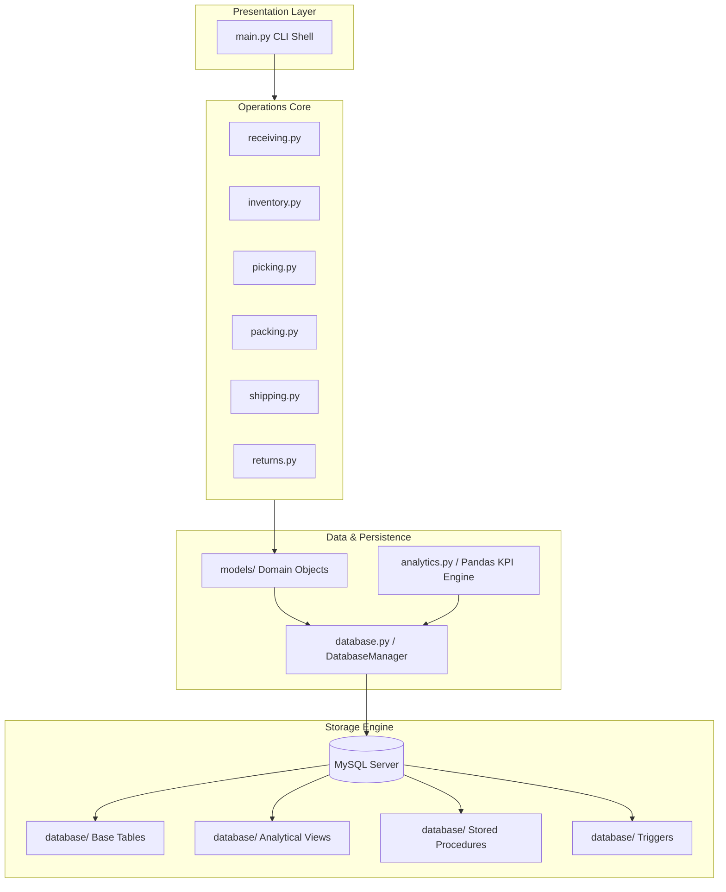

# System Architecture: Warehouse Operations Simulator

This document details the system design, decoupling patterns, and database connectivity architectures of the simulator.

## 1. Architectural Layers

The system is built using a decoupled multi-layer pattern to follow SOLID principles:

### Layer Details:
1.  **Presentation Layer (`main.py`)**: Responsible for presenting the interactive CLI console options to the user, managing command selections, running execution loops, and querying details for search outputs.
2.  **Operations Core (`simulator/`)**: Houses the transaction logic for each warehouse station (Receiving, Inventory, Picking, Packing, Shipping, Returns). These modules coordinate transitions, run QA evaluations, and trigger inventory reservations.
3.  **Data & Persistence Layer (`models/` & `database.py`)**:
    *   `models/` defines domain models (e.g., `Product`, `Order`, `WarehouseLocation`) which hold state and serialize data inputs.
    *   `database.py` manages a pooled connection manager (`mysql.connector.pooling`), executing transactional batch commands and handling recovery rollbacks.
4.  **Pandas Analytics Engine (`simulator/analytics.py`)**: Direct data access helper querying database states into Pandas DataFrames, computing inventory, shipping delay, and order metrics, and exporting flat datasets for Power BI dashboard integrations.

---

## 2. Database Integration Pattern
*   **Connection Pooling**: Uses thread-safe connection pooling to minimize connection overheads.
*   **Transaction Boundaries**: Business transactions span multiple queries (e.g., deducting inventory and updating orders). These are encapsulated in `DatabaseManager.execute_transaction()` to guarantee atomicity. If a single statement fails, a database `ROLLBACK` is issued.
*   **Procedural Offloading**: High-compute operations (like finding storage bins with available capacity or checking order stocks) are offloaded to MySQL Stored Procedures (`AllocateInventoryLocation`, `ReserveInventoryForOrder`) to enforce server-side data integrity.
*   **Dynamic Triggers**: Used to automatically update storage slot capacities (`current_capacity`) when inventory tuples are inserted, deleted, or modified, keeping structural metadata in sync.
