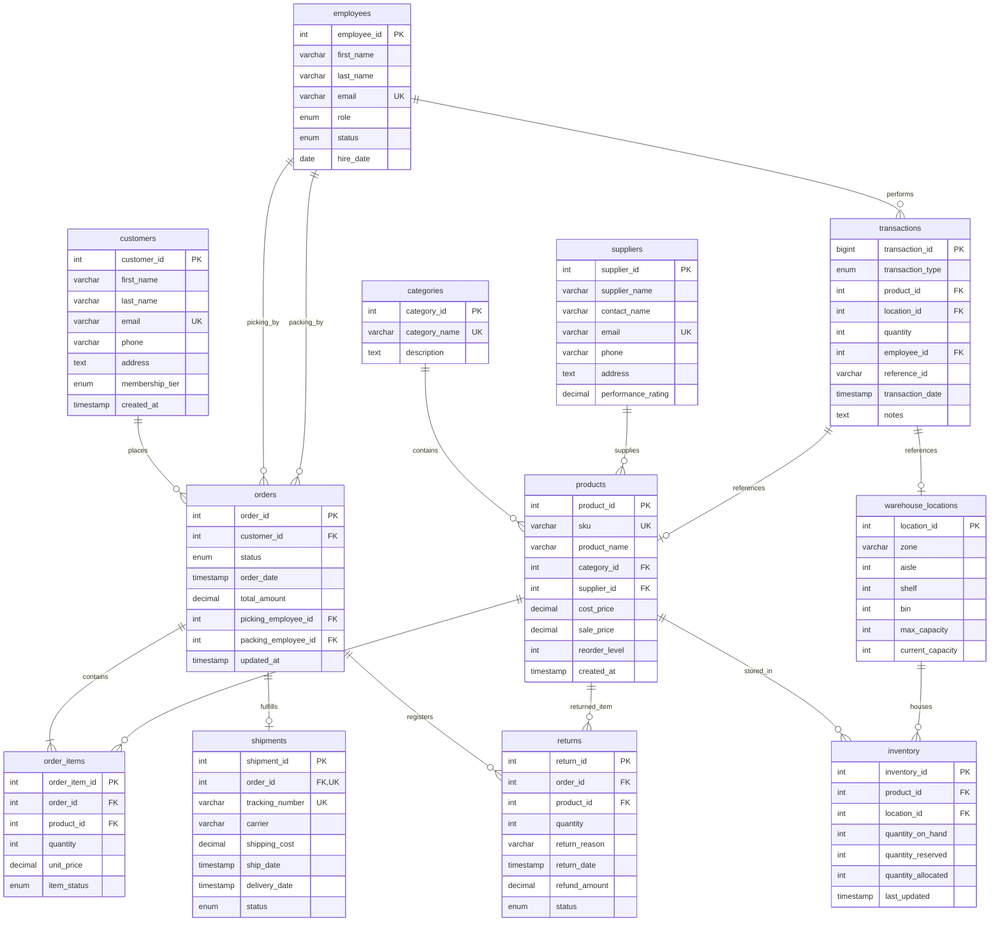

# Entity-Relationship (ER) Diagram

This document describes the relational database structure, primary/foreign keys, and cardinalities.

## 1. Database Entity-Relationship Model

```mermaid
erDiagram
    categories {
        int category_id PK
        varchar category_name UK
        text description
    }
    suppliers {
        int supplier_id PK
        varchar supplier_name
        varchar contact_name
        varchar email UK
        varchar phone
        text address
        decimal performance_rating
    }
    products {
        int product_id PK
        varchar sku UK
        varchar product_name
        int category_id FK
        int supplier_id FK
        decimal cost_price
        decimal sale_price
        int reorder_level
        timestamp created_at
    }
    customers {
        int customer_id PK
        varchar first_name
        varchar last_name
        varchar email UK
        varchar phone
        text address
        enum membership_tier
        timestamp created_at
    }
    employees {
        int employee_id PK
        varchar first_name
        varchar last_name
        varchar email UK
        enum role
        enum status
        date hire_date
    }
    warehouse_locations {
        int location_id PK
        varchar zone
        int aisle
        int shelf
        int bin
        int max_capacity
        int current_capacity
    }
    inventory {
        int inventory_id PK
        int product_id FK
        int location_id FK
        int quantity_on_hand
        int quantity_reserved
        int quantity_allocated
        timestamp last_updated
    }
    orders {
        int order_id PK
        int customer_id FK
        enum status
        timestamp order_date
        decimal total_amount
        int picking_employee_id FK
        int packing_employee_id FK
        timestamp updated_at
    }
    order_items {
        int order_item_id PK
        int order_id FK
        int product_id FK
        int quantity
        decimal unit_price
        enum item_status
    }
    shipments {
        int shipment_id PK
        int order_id FK, UK
        varchar tracking_number UK
        varchar carrier
        decimal shipping_cost
        timestamp ship_date
        timestamp delivery_date
        enum status
    }
    returns {
        int return_id PK
        int order_id FK
        int product_id FK
        int quantity
        varchar return_reason
        timestamp return_date
        decimal refund_amount
        enum status
    }
    transactions {
        bigint transaction_id PK
        enum transaction_type
        int product_id FK
        int location_id FK
        int quantity
        int employee_id FK
        varchar reference_id
        timestamp transaction_date
        text notes
    }

    categories ||--o{ products : "contains"
    suppliers ||--o{ products : "supplies"
    products ||--o{ inventory : "stored_in"
    warehouse_locations ||--o{ inventory : "houses"
    customers ||--o{ orders : "places"
    orders ||--|{ order_items : "contains"
    products ||--o{ order_items : "ordered_in"
    employees ||--o{ orders : "picking_by"
    employees ||--o{ orders : "packing_by"
    orders ||--o| shipments : "fulfills"
    orders ||--o{ returns : "registers"
    products ||--o{ returns : "returned_item"
    employees ||--o{ transactions : "performs"
    transactions ||--o| products : "references"
    transactions ||--o| warehouse_locations : "references"
```
