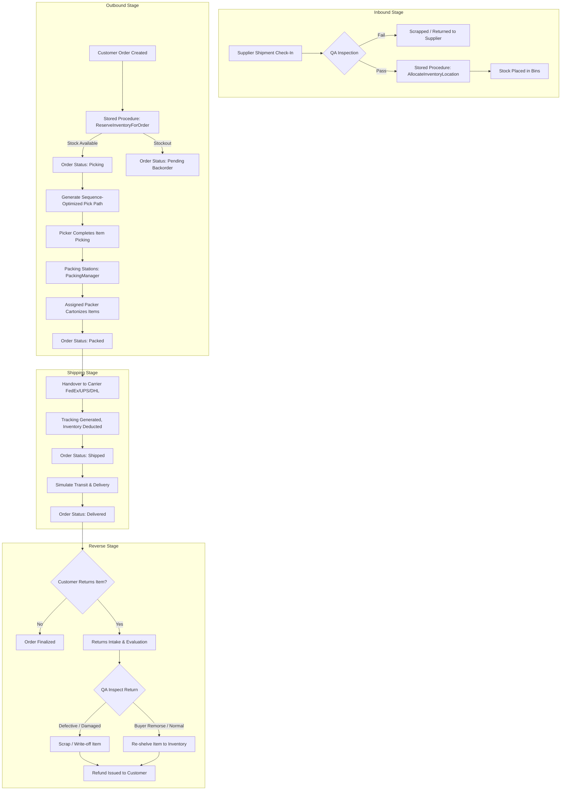

# Warehouse Operations Simulation Workflow

This document illustrates the lifecycle of items and orders moving through the simulated warehouse.

## 1. Operations Workflow Diagram

## 2. Operational Event Triggers
*   **Receiving**: Triggers a `RECEIVING` transaction record + `PUT_AWAY` transaction. Increments `quantity_on_hand` in inventory.
*   **Reservation**: Triggers a `RESERVATION` transaction record. Moves items from `quantity_on_hand` to `quantity_reserved`.
*   **Picking**: Triggers a `PICKING` transaction record as the Picker moves items from the shelf to the cart.
*   **Packing**: Triggers a `PACKING` transaction record. Packer prepares the physical parcel and verifies order lines.
*   **Shipping**: Handover to carrier carrier. Triggers a `SHIPPING` transaction record. Deducts the quantities from `quantity_on_hand` and `quantity_reserved` completely.
*   **Delivery**: Simulates the customer receiving the order. Triggers a `DELIVERY` transaction.
*   **Returns**: Triggers a `RETURN_INSPECTED` transaction. Initiates restocking transactions if items pass inspection, otherwise registers quality write-off audits.
